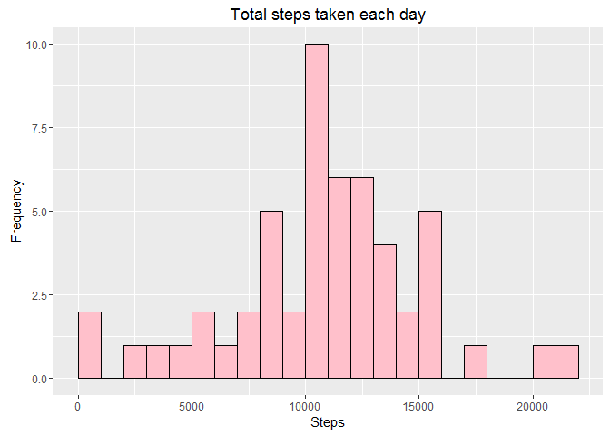
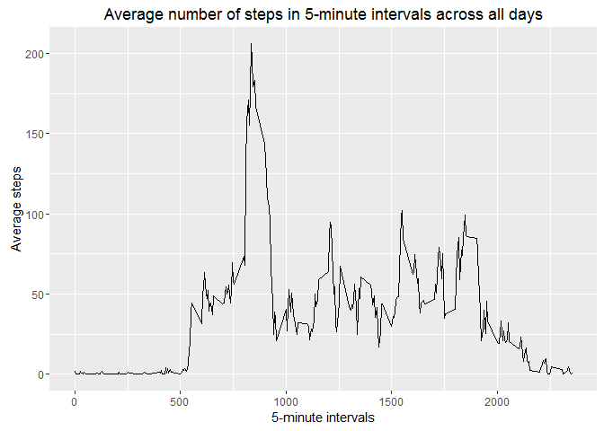
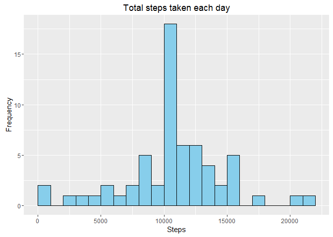
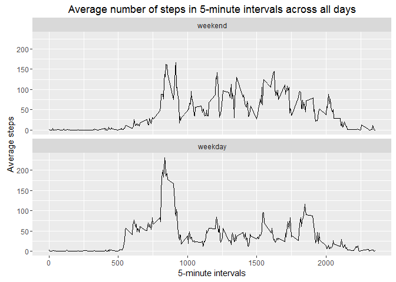

# Reproducible Research: Peer Assessment 1


## Loading and preprocessing the data
First, load the data from **activity.zip**.

```r
unzip("activity.zip")
activityDF <- read.csv("activity.csv")

str(activityDF)
```

```
## 'data.frame':	17568 obs. of  3 variables:
##  $ steps   : int  NA NA NA NA NA NA NA NA NA NA ...
##  $ date    : Factor w/ 61 levels "2012-10-01","2012-10-02",..: 1 1 1 1 1 1 1 1 1 1 ...
##  $ interval: int  0 5 10 15 20 25 30 35 40 45 ...
```

Then, convert classes of **steps** to *numeric* and **date** to *Date*.

```r
activityDF[,1] <- as.numeric(activityDF[,1])
activityDF[,2] <- as.Date(as.character(activityDF[,2]), format = "%Y-%m-%d")

str(activityDF)
```

```
## 'data.frame':	17568 obs. of  3 variables:
##  $ steps   : num  NA NA NA NA NA NA NA NA NA NA ...
##  $ date    : Date, format: "2012-10-01" "2012-10-01" ...
##  $ interval: int  0 5 10 15 20 25 30 35 40 45 ...
```

```r
head(activityDF)
```

```
##   steps       date interval
## 1    NA 2012-10-01        0
## 2    NA 2012-10-01        5
## 3    NA 2012-10-01       10
## 4    NA 2012-10-01       15
## 5    NA 2012-10-01       20
## 6    NA 2012-10-01       25
```

## What is mean total number of steps taken per day?

**1. Calculate the total number of steps taken per day**

```r
#Load library
library(reshape2)

#Process data for steps and date
stepsDate <- subset(activityDF[,1:2])
stepsDate <- subset(na.omit(stepsDate))
stepsDate <- melt(stepsDate, id = "date")
stepsDate <- dcast(stepsDate, date ~ variable, sum)

summary(stepsDate)
```

```
##       date                steps      
##  Min.   :2012-10-02   Min.   :   41  
##  1st Qu.:2012-10-16   1st Qu.: 8841  
##  Median :2012-10-29   Median :10765  
##  Mean   :2012-10-30   Mean   :10766  
##  3rd Qu.:2012-11-16   3rd Qu.:13294  
##  Max.   :2012-11-29   Max.   :21194
```

**2. Make a histogram of the total number of steps taken each day**

```r
#Load library
library(ggplot2)

#Plot histogram
ggplot(stepsDate, aes(x = steps)) + 
  geom_histogram(binwidth = 1000, boundary = 0, col = "black", fill = "pink") +
  labs(title = "Total steps taken each day", x = "Steps", y = "Frequency")
```

<!-- -->


**3. Calculate and report the mean and median total number of steps taken per day**

```r
#Calculate mean and median
mymean <- round(mean(stepsDate$steps), 2)
mymedian <- round(median(stepsDate$steps), 2)
```

```r
#Print mean
mymean
```

```
## [1] 10766.19
```

```r
#Print median
mymedian
```

```
## [1] 10765
```

The **mean** total number of steps taken per day is **10766.19**.

The **median** total number of steps taken per day is **10765**.

*Note: These values were obtained by ignoring/removing NA rows prior to calculation.*


## What is the average daily activity pattern?

**1. Make a time series plot (i.e. type = "l") of the 5-minute interval (x-axis) and the average number of steps taken, averaged across all days (y-axis)**

```r
#Process data for steps and interval
stepsInterval <- subset(activityDF[,-2])
stepsInterval <- subset(na.omit(stepsInterval))
stepsInterval <- melt(stepsInterval, id = "interval", na.rm = TRUE)
stepsInterval <- dcast(stepsInterval, interval ~ variable, mean)

#Plot line
ggplot(stepsInterval, aes(interval, steps)) + geom_line() +
  labs(title = "Average number of steps in 5-minute intervals across all days",
       x = "5-minute intervals",
       y = "Average steps")
```

<!-- -->


**2. Which 5-minute interval, on average across all the days in the dataset, contains the maximum number of steps?**

```r
#Interval with max number of steps
myInterval <- stepsInterval$interval[which.max(stepsInterval$steps)]

#Max number of steps
mySteps <- round(stepsInterval$steps[which.max(stepsInterval$steps)],2)
```

```r
#Print interval
myInterval
```

```
## [1] 835
```

```r
#Print max number of steps
mySteps
```

```
## [1] 206.17
```
Interval **835** contains the maximum number of steps (206.17).


## Imputing missing values

**1. Calculate and report the total number of missing values in the dataset (i.e. the total number of rows with NAs)**

```r
#Number of rows with missing values
naRows <- sum(is.na(activityDF$steps))
```

```r
#Print number of NA rows
naRows
```

```
## [1] 2304
```

The total number of missing values in the dataset (i.e. the total number of rows with NAs) is **2304**. 

This accounts for 13.11% of the dataset.


**2. Devise a strategy for filling in all of the missing values in the dataset. The strategy does not need to be sophisticated.**

To fill in the missing values, the mean steps of 5-minute intervals across all days were determined (excluding NAs), i.e. steps were grouped by the interval number they belonged to across all days and averaged.

These values were then substituted into the NA-valued steps at their respective time intervals.


**3. Create a new dataset that is equal to the original dataset but with the missing data filled in.**

```r
#Create new dataset to fill in missing values
newActivityDF <- activityDF

#Replace NAs with mean of respective 5-minute intervals
for(i in 1:nrow(newActivityDF))
{
  if(is.na(newActivityDF[i,1]))
  {
    newActivityDF[i,1] <- with(newActivityDF, mean(steps[interval == newActivityDF[i,3]], na.rm = TRUE))
  }
}

str(newActivityDF)
```

```
## 'data.frame':	17568 obs. of  3 variables:
##  $ steps   : num  1.717 0.3396 0.1321 0.1509 0.0755 ...
##  $ date    : Date, format: "2012-10-01" "2012-10-01" ...
##  $ interval: int  0 5 10 15 20 25 30 35 40 45 ...
```

```r
head(newActivityDF)
```

```
##       steps       date interval
## 1 1.7169811 2012-10-01        0
## 2 0.3396226 2012-10-01        5
## 3 0.1320755 2012-10-01       10
## 4 0.1509434 2012-10-01       15
## 5 0.0754717 2012-10-01       20
## 6 2.0943396 2012-10-01       25
```


**4. Make a histogram of the total number of steps taken each day and Calculate and report the mean and median total number of steps taken per day. Do these values differ from the estimates from the first part of the assignment? What is the impact of imputing missing data on the estimates of the total daily number of steps?**

```r
#Process data for steps and date
newStepsDate <- subset(newActivityDF[,1:2])
newStepsDate <- melt(newStepsDate, id = "date")
newStepsDate <- dcast(newStepsDate, date ~ variable, sum)

#Plot histogram
ggplot(newStepsDate, aes(x = steps)) + 
  geom_histogram(binwidth = 1000, boundary = 0, col = "black", fill = "sky blue") +
  labs(title = "Total steps taken each day", x = "Steps", y = "Frequency")
```

<!-- -->

Calculating the new mean and median values:

```r
#Calculate new mean and median
myNewMean <- round(mean(newStepsDate$steps), 2)
myNewMedian <- round(median(newStepsDate$steps), 2)
```

```r
#Print new mean
myNewMean
```

```
## [1] 10766.19
```

```r
#Print new median
myNewMedian
```

```
## [1] 10766.19
```

The **mean** total number of steps taken per day is now **10766.19**. 
This differs from the first estimate (10766.19) by **0**.

The **median** total number of steps taken per day is now **10766.19**.
This differs from the first estimate (10765) by **1.19**.

There is 0% impact to the mean, and a negligible 0.01% impact to the median.

*Note: Recall that the first mean and median estimates were derived by ignoring/removing NA rows prior to calculation.*


## Are there differences in activity patterns between weekdays and weekends?

**1. Create a new factor variable in the dataset with two levels -- "weekday" and "weekend" indicating whether a given date is a weekday or weekend day.**

```r
#Create new data set to add new wday factor column
daysActivityDF <- newActivityDF
myweekdays <- c("Monday", "Tuesday", "Wednesday", "Thursday", "Friday")
daysActivityDF$wday <- factor((weekdays(activityDF$date) %in% myweekdays),
                              levels = c(FALSE,TRUE),
                              labels = c("weekend", "weekday"))

str(daysActivityDF)
```

```
## 'data.frame':	17568 obs. of  4 variables:
##  $ steps   : num  1.717 0.3396 0.1321 0.1509 0.0755 ...
##  $ date    : Date, format: "2012-10-01" "2012-10-01" ...
##  $ interval: int  0 5 10 15 20 25 30 35 40 45 ...
##  $ wday    : Factor w/ 2 levels "weekend","weekday": 2 2 2 2 2 2 2 2 2 2 ...
```

```r
head(daysActivityDF)
```

```
##       steps       date interval    wday
## 1 1.7169811 2012-10-01        0 weekday
## 2 0.3396226 2012-10-01        5 weekday
## 3 0.1320755 2012-10-01       10 weekday
## 4 0.1509434 2012-10-01       15 weekday
## 5 0.0754717 2012-10-01       20 weekday
## 6 2.0943396 2012-10-01       25 weekday
```


**2. Make a panel plot containing a time series plot (i.e. type = "l") of the 5-minute interval (x-axis) and the average number of steps taken, averaged across all weekday days or weekend days (y-axis).**

```r
#Process data for steps and interval using dataset with imputed values
stepsIntervalWday <- subset(daysActivityDF[,-2])
stepsIntervalWday <- melt(stepsIntervalWday, id = c("interval", "wday"))
stepsIntervalWday <- dcast(stepsIntervalWday, interval + wday ~ variable, mean)

#Plot lines in two facets
ggplot(stepsIntervalWday, aes(interval, steps)) + 
  geom_line() +
  facet_wrap(~ wday , ncol = 1) +
  labs(title = "Average number of steps in 5-minute intervals across all days",
       x = "5-minute intervals",
       y = "Average steps")
```

<!-- -->
